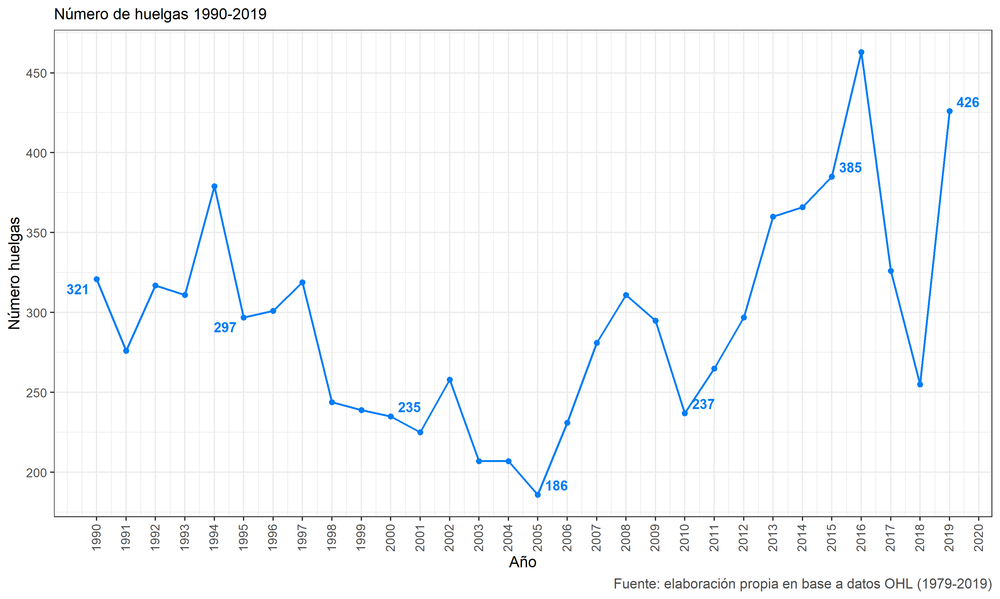
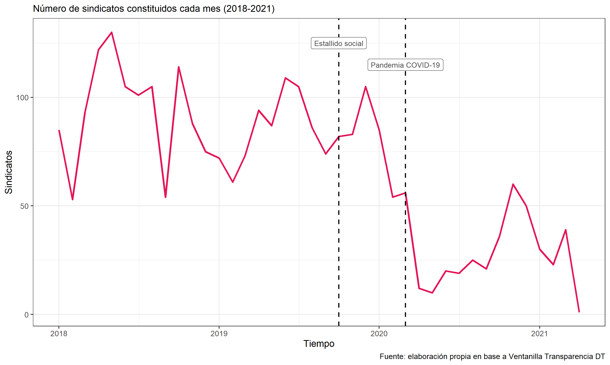

class: segue-violet
background-image: url("assets/logo/RES-08.png")
background-size: 12%
background-position: 99% 1%


# Contexto y motivación

---
background-image: url("assets/logo/RES-04.png")
background-size: 12%
background-position: 100% 1%

```{r packages, include=FALSE, echo=FALSE}

if (!require("pacman")) install.packages("pacman") 

pacman::p_load(tidyverse, ggplot2, sjmisc, summarytools, sjPlot,
               kableExtra, withr, magick, png, gifski, dygraphs, 
               showtext, htmlTable, gridExtra, gtsummary, openxlsx,
               ggrepel)
```


```{r setup, include=FALSE, eval=TRUE}

knitr::opts_chunk$set(comment=NA, prompt=FALSE, cache=FALSE, echo=TRUE, results='asis', message = F, warning = F)

options(htmltools.dir.version = FALSE)

summarytools::st_options(bootstrap.css     = FALSE,
           plain.ascii       = FALSE,   
           style             = "rmarkdown",
           dfSummary.silent  = TRUE, 
           footnote          = NA,
           subtitle.emphasis = FALSE,
           headings =  F,
           lang =  "es")

summarytools::st_css()

options(knitr.kable.NA = 'No sabe/No responde', kableExtra.auto_format = FALSE)
```


## Motivación/contexto

<br>


### Revitalización sindical 

.large[En la última década, Chile ha experimentado un resurgimiento y/o **revitalización** de la **actividad sindical**.]

<br>

--

#### Algunas perspectivas

.large[
- **Politización** (2010-2019): 

    + Aumento en los niveles de politización de la sociedad en general y del **movimiento sindical** en particular *(Aravena & Núñez, 2009; von Bülow & Donoso, 2017)*
    
    + Expresado en un cambio en las **orientaciones** de ciertos sectores sindicales con nuevas formas de organización, objetivos y repertorios de acción *(Campusano et al., 2017; Medel et al., 2021; Julián et al., 2019)*.] 
    

---
background-image: url("assets/logo/RES-04.png")
background-size: 12%
background-position: 100% 1%

## Revitalización sindical 

- .large[**Conflictividad laboral** (2006-2019): alza en la **actividad huelguista** caracterizada por el aumento exponencial <br> de vías extra-legales y la cantidad de trabajadores movilizados *(Medel et al., 2021; OHL, 2020)*.]

```{r echo=FALSE, results='asis', out.width = '75%', echo = FALSE, fig.align = 'center'}

```


---
background-image: url("assets/logo/RES-04.png")
background-size: 12%
background-position: 100% 1%

## Revitalización sindical

- .large[**Afiliación sindical** (2010-2019): se ha registrado un **lento pero consistente aumento** en las tasas de afiliación <br> sindical en la última década *(Pérez-Ahumada, 2020)*.]


```{r echo=FALSE, results='asis', out.width = '75%', echo = FALSE, fig.align = 'center'}

```

---
background-image: url("assets/logo/RES-04.png")
background-size: 12%
background-position: 100% 1%

## Coyunturas críticas

### Estallido social 2019

- .large[Liderazgo relativo que, como expresión de **tendencias de más larga data** (2006-2018), encontró un rol relevante en la potencialidad disruptiva -ejemplo **huelga general del 12 de noviembre** del 2019- *(OHL, 2020; Osorio & Velásquez, 2021)*.]


### Pandemia COVID-19

- .large[Impacto negativo en el **empleo y en la economía**: aumento de desocupación laboral, desempleo y reducción de fracciones importantes en la fuerza de trabajo como las mujeres *(OIT, 2020)*].

- .large[Impacto en la huelga: **reducción** en casi un 50% en la **actividad huelguista** respecto al 2019 *(OHL, 2020)*.]

.content-box-red[

Preguntas clave:

- **¿Cuál era el estado de la formación sindical en Chile durante las dos coyunturas más críticas que ha atravesado el país en las últimas décadas?**

]

---
class: segue-violet
background-image: url("assets/logo/RES-08.png")
background-size: 12%
background-position: 99% 1%


# Resultados


---
background-image: url("assets/logo/RES-04.png")
background-size: 12%
background-position: 100% 1%

## Sindicatos activos


```{r echo=FALSE, results='asis', out.width = '72%', echo = FALSE, fig.align = 'center'}

```

- .large[Según los últimos datos de la Dirección del Trabajo (DT), hubo 11.926 sindicatos activos en el año 2019 y 12.355 en el 2020 *(Compendio Estadístico, 2020)*.] 


---
background-image: url("assets/logo/RES-04.png")
background-size: 12%
background-position: 100% 1%

## Sindicatos constituidos

```{r echo=FALSE, results='asis', out.width = '72%', echo = FALSE, fig.align = 'center'}

```

- .large[Según los últimos datos de la Dirección del Trabajo (DT), al año 2020 se constituyeron 448 sindicatos, lo cual se condice con las estimaciones del microdato *(Anuario Estadístico, 2020)*]

---
background-image: url("assets/logo/RES-04.png")
background-size: 12%
background-position: 100% 1%

## Sindicatos constituidos por región

```{r echo=FALSE, results='asis', out.width = '70%', echo = FALSE, fig.align = 'center'}

```


---
background-image: url("assets/logo/RES-04.png")
background-size: 12%
background-position: 100% 1%

## Tasas de afiliación sindical

```{r echo=FALSE, results='asis', out.width = '70%', echo = FALSE, fig.align = 'center'}

```

---
background-image: url("assets/logo/RES-04.png")
background-size: 12%
background-position: 100% 1%

## Tasas de afiliación sindical

.large[
Debido a que la DT ya publicó las cifras del 2020, ahora es posible comparar estas estimaciones con las oficiales:

] 

.pull-left[

.content-box-purple[

**Dirección del Tabajo 2020**

1. TS1 = **15.5%**

2. TS2 = **18.9%**

3. TS3  = **22.2%**

]]

.pull-right[

.content-box-purple[

**Estimación RES 2020**

1. TS1 = **15.49%**

2. TS2 = **18.91%**

3. TS3 = **22.27%**

]]
 
<br><br>

.content-box-grey[

Nota:

- .large[**El aumento en las tres tasas en el 2020 se asocia a la fuerte caída en el empleo y en la tasa de participación de la fuerza de trabajo por efecto pandemia COVID-19.**]


]
---
class: segue-violet
background-image: url("assets/logo/RES-08.png")
background-size: 12%
background-position: 99% 1%


# Síntesis y reflexiones


---
background-image: url("assets/logo/RES-04.png")
background-size: 12%
background-position: 100% 1%

## Recapitulando

<br>

.content-box-red[

Hallazgos principales


**1. Disminución en la cantidad de sindicatos activos (2019-2020), con leve aumento en Octubre del 2019 y una abrupta caída a inicios 2020.**

**2. Incremento en la cantidad de sindicatos constituidos post Estallido. Disminución en el "ritmo" de constitución sindical posterior a diciembre del 2019 hasta comienzos del 2020.**

**3. Aumento en las tasas de afiliación sindical en el año 2020, pero que estaría explicada por la fuerte caída en la ocupación y fuerza de trabajo.**


]


## Reflexión

- **¿?**


---
class: violet
background-image: url("assets/logo/RES-08.png")
background-size: 40%
background-position: 5% 95%

.white[
# ¡Gracias!
]

**Como citar:** 

Ratto, N., Lafferte, A., y Marchant, F. (2021) Minuta N°1: *Sindicatos en la coyuntura del estallido social y la pandemia (2018-2021). Una descripción cuantitativa en base a registros administrativos públicos*. Repositorio de Estadísticas Sindicales (RES). 


.pull-right[.pull-down[

<a href="https://repositoriosindical.netlify.app/minutas/ ">
.white[`r icons::fontawesome("link")` repositoriosindical.netlify.app/minutas]
</a>

<a href="http://github.com/repositoriosindical">
.white[`r icons::fontawesome("github")` @repositoriosindical]
</a>

<br><br><br><br><br>

]]
